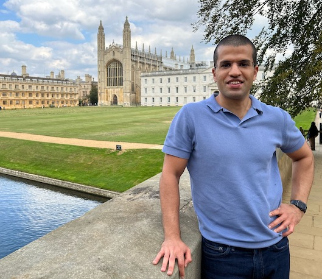

# Khaled Baqer


---

<p style="text-align: center;">
<code style="font-weight: bold;">
[Main](https://kbaqer.com/index.html) // [Contact](https://kbaqer.com/index.html/#contact)
</code> 
</p>
<!-- 
<p style="text-align: center;">
<code>
[`whoami`](#whoami) // [Contact](#contact) // [Research](#research)
</code>
</p> -->

---	


## `whoami`




I am a Principal Product Security Engineer at [Entrust](https://www.entrust.com) (previously: nCipher Security), since January 2019.

I completed my PhD in Computer Science at the [University of Cambridge](https://www.cam.ac.uk/) ([Security Group](https://www.cl.cam.ac.uk/research/security/); [Computer Laboratory](https://www.cl.cam.ac.uk/)), supervised by [Professor Ross Anderson](https://www.cl.cam.ac.uk/~rja14/). My thesis was published in November 2018: Baqer, K. (2018). *[Resilient payment systems (Doctoral thesis)](https://doi.org/10.17863/CAM.32372)*. I did my Master of Information Technology (Honours) at Monash University (Melbourne, Australia). I did my undergraduate at Georgetown University (Washington D.C.). And before that, I was at the Hun School of Princeton, New Jersey.

I am based in Cambridge, England.


## Contact

Email main: 

```bash
forename_at_protonmail_dot_com 
```

or:

```bash
forename.lastname_at_gmail_dot_com
```

<b>[GPG key](khaled_2019_C8F0A0B5D9C34D0082A71ACBC33D4801C2649BEC.asc)
</b>

```bash
C8F0 A0B5 D9C3 4D00 82A7 1ACB C33D 4801 C264 9BEC
```

<!-- # [blog](blog/index.html) -->

## Research

Research output will be located at the following page: <b>[Research](research/index.html)</b>.

